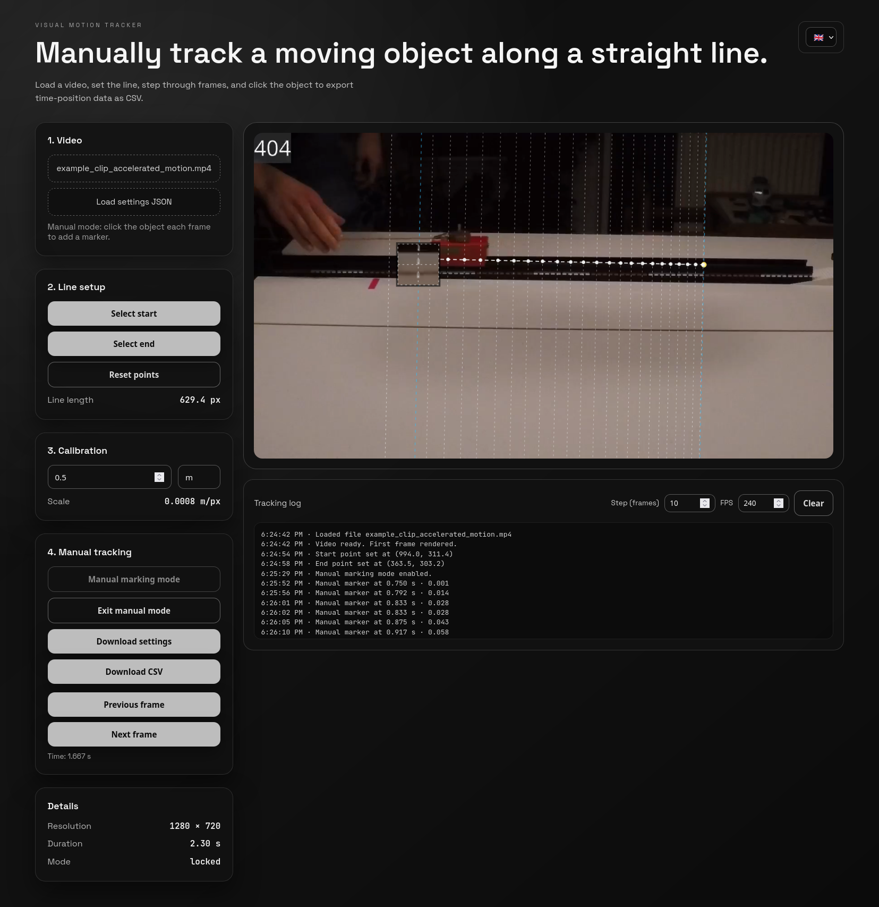

# Visual Motion Tracker

Webapp tool for manually tracking an object's position along a straight line in a video and exporting time/position data for Physics experiments.

The app is inspired by the [Vianna 2](https://apps.apple.com/de/app/viana-2/id1554845327) app but focuses on straight line movements. In comparison to Vianna there is no auto detection of movements or anything. Think of it as a measuring tape on steroids that makes you more efficient and precise.

Give it a try: https://twyleg.github.io/edu_physics_visual_motion_tracking/ 

## Using the app
- Load a video file, then click on the canvas to set the start and end points of the motion path.
- Enter the real-world distance between those points and your unit label to calibrate pixel distance to real distance.
- Switch to manual marking mode, then step frames (buttons or arrow keys) and click the object each frame; adjust `Step (frames)` or FPS override as needed.
- Export results as CSV; download/load a settings JSON to save or restore line/scale/markers between sessions.
- Line and scale are also remembered in cookies; use **Reset points** to clear them.

## Dev Environment

### Prereqs

- Node.js ≥18.19
- npm

### Setup

Init and run:

    npm install
    npm run dev

